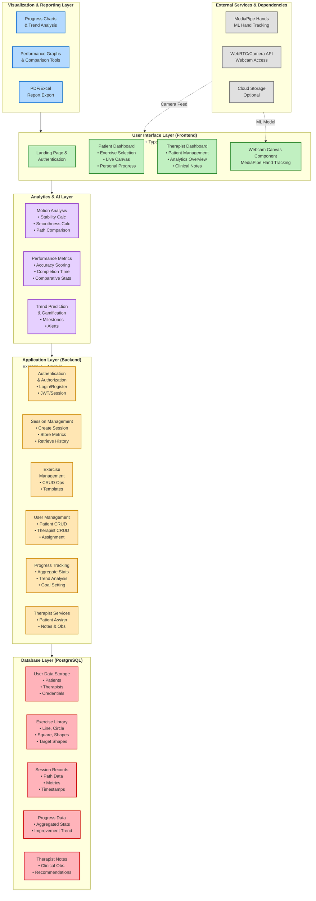

# Rehab-Canvas System Architecture

## Proposed System Architecture

### Mermaid Diagram (Interactive)



### ASCII Diagram (Text-Based)

```
┌─────────────────────────────────────────────────────────────────────────────┐
│                      Visualization & Reporting Layer                        │
│  ┌──────────────────────┐  ┌──────────────────────┐  ┌──────────────────┐  │
│  │   Progress Charts    │  │  Performance Graphs  │  │  PDF/Excel       │  │
│  │   & Trend Analysis   │  │  & Comparison Tools  │  │  Report Export   │  │
│  └──────────────────────┘  └──────────────────────┘  └──────────────────┘  │
└─────────────────────────────────────────────────────────────────────────────┘
                                        │
                                        ▼
┌─────────────────────────────────────────────────────────────────────────────┐
│                       User Interface Layer (Frontend)                       │
│                         React + TypeScript + Vite                           │
│  ┌────────────────────────────────────────────────────────────────────┐    │
│  │  Landing Page    │    Authentication    │    Role-Based Routing    │    │
│  └────────────────────────────────────────────────────────────────────┘    │
│  ┌────────────────────────────────────────────────────────────────────┐    │
│  │  Patient Dashboard       │       Therapist Dashboard                │    │
│  │  - Exercise Selection    │       - Patient Management               │    │
│  │  - Live Canvas           │       - Analytics Overview               │    │
│  │  - Personal Progress     │       - Patient Details View             │    │
│  │  - Session History       │       - Clinical Notes                   │    │
│  └────────────────────────────────────────────────────────────────────┘    │
│  ┌────────────────────────────────────────────────────────────────────┐    │
│  │  Webcam Canvas Component (MediaPipe Integration)                    │    │
│  │  - Real-time Hand Tracking  │  - Air Drawing Capture                │    │
│  └────────────────────────────────────────────────────────────────────┘    │
└─────────────────────────────────────────────────────────────────────────────┘
                                        │
                                        ▼
┌─────────────────────────────────────────────────────────────────────────────┐
│                         Analytics & AI Layer                                │
│  ┌──────────────────────┐  ┌──────────────────────┐  ┌──────────────────┐  │
│  │  Motion Analysis     │  │  Performance Metrics │  │  Trend Prediction│  │
│  │  - Stability Calc    │  │  - Accuracy Scoring  │  │  & Gamification  │  │
│  │  - Smoothness Calc   │  │  - Completion Time   │  │  - Milestones    │  │
│  │  - Path Comparison   │  │  - Comparative Stats │  │  - Alerts        │  │
│  └──────────────────────┘  └──────────────────────┘  └──────────────────┘  │
└─────────────────────────────────────────────────────────────────────────────┘
                                        │
                                        ▼
┌─────────────────────────────────────────────────────────────────────────────┐
│                      Application Layer (Backend)                            │
│                         Express.js + Node.js                                │
│  ┌──────────────────────┐  ┌──────────────────────┐  ┌──────────────────┐  │
│  │  Authentication      │  │  Session Management  │  │  Exercise        │  │
│  │  & Authorization     │  │  - Create Session    │  │  Management      │  │
│  │  - Login/Register    │  │  - Store Metrics     │  │  - CRUD Ops      │  │
│  │  - JWT/Session       │  │  - Retrieve History  │  │  - Templates     │  │
│  └──────────────────────┘  └──────────────────────┘  └──────────────────┘  │
│  ┌──────────────────────┐  ┌──────────────────────┐  ┌──────────────────┐  │
│  │  User Management     │  │  Progress Tracking   │  │  Therapist       │  │
│  │  - Patient CRUD      │  │  - Aggregate Stats   │  │  Services        │  │
│  │  - Therapist CRUD    │  │  - Trend Analysis    │  │  - Patient Assign│  │
│  │  - Patient-Therapist │  │  - Goal Setting      │  │  - Notes & Obs   │  │
│  └──────────────────────┘  └──────────────────────┘  └──────────────────┘  │
└─────────────────────────────────────────────────────────────────────────────┘
                                        │
                                        ▼
┌─────────────────────────────────────────────────────────────────────────────┐
│                         Database Layer (PostgreSQL)                         │
│  ┌──────────────────────┐  ┌──────────────────────┐  ┌──────────────────┐  │
│  │  User Data Storage   │  │  Exercise Library    │  │  Session Records │  │
│  │  - Patients          │  │  - Line, Circle      │  │  - Path Data     │  │
│  │  - Therapists        │  │  - Square, Shapes    │  │  - Metrics       │  │
│  │  - Credentials       │  │  - Target Shapes     │  │  - Timestamps    │  │
│  └──────────────────────┘  └──────────────────────┘  └──────────────────┘  │
│  ┌──────────────────────┐  ┌──────────────────────┐                        │
│  │  Progress Data       │  │  Therapist Notes     │                        │
│  │  - Aggregated Stats  │  │  - Clinical Obs.     │                        │
│  │  - Improvement Trend │  │  - Recommendations   │                        │
│  └──────────────────────┘  └──────────────────────┘                        │
└─────────────────────────────────────────────────────────────────────────────┘
                                        │
                                        ▼
┌─────────────────────────────────────────────────────────────────────────────┐
│                      External Services & Dependencies                       │
│  ┌──────────────────────┐  ┌──────────────────────┐  ┌──────────────────┐  │
│  │  MediaPipe Hands     │  │  WebRTC/Camera API   │  │  Cloud Storage   │  │
│  │  (ML Hand Tracking)  │  │  (Webcam Access)     │  │  (Optional)      │  │
│  └──────────────────────┘  └──────────────────────┘  └──────────────────┘  │
└─────────────────────────────────────────────────────────────────────────────┘
```

---

## Layer Descriptions

### 1. **Visualization & Reporting Layer**
- **Progress Charts & Trend Analysis**: Line/bar charts showing improvement over time
- **Performance Graphs & Comparison**: Side-by-side session comparisons, therapist vs patient view
- **PDF/Excel Report Export**: Generate downloadable reports for medical records

### 2. **User Interface Layer (Frontend)**
- **Technology**: React, TypeScript, Vite, TailwindCSS, Shadcn UI
- **Patient Interface**: Exercise selection, live air-drawing canvas, personal metrics
- **Therapist Interface**: Multi-patient dashboard, analytics, clinical notes
- **Webcam Canvas**: Real-time hand tracking visualization with MediaPipe

### 3. **Analytics & AI Layer**
- **Motion Analysis**: Calculate stability, smoothness, path deviation
- **Performance Metrics**: Scoring algorithms for exercise accuracy and completion
- **Trend Prediction**: ML-based improvement forecasting, gamification elements

### 4. **Application Layer (Backend)**
- **Technology**: Express.js, Node.js, TypeScript
- **REST API**: User authentication, session CRUD, exercise management
- **Business Logic**: Patient-therapist assignment, progress aggregation
- **Security**: JWT/session-based auth, role-based access control

### 5. **Database Layer**
- **Technology**: PostgreSQL with Drizzle ORM
- **Schema**: Users, Exercises, Sessions, Progress, TherapistNotes
- **Storage**: Hand motion path data (JSON), metrics, user profiles

### 6. **External Services**
- **MediaPipe Hands**: Google's hand landmark detection ML model
- **Browser APIs**: WebRTC for camera access, Canvas API for drawing
- **Optional**: Cloud storage for session recordings, backup services

---

## Data Flow Example: Patient Exercise Session

```
1. Patient logs in → Frontend auth → Backend validates → JWT issued
2. Patient selects exercise → Frontend fetches from DB → Display instructions
3. Webcam activated → MediaPipe tracks hand → Real-time landmarks captured
4. Patient draws in air → Frontend records path data → Visualize on canvas
5. Session ends → Calculate metrics (stability, smoothness, accuracy)
6. Send to backend → Store in sessions table → Update progress aggregates
7. Display results → Show graphs → Compare with previous sessions
8. Therapist reviews → Access patient detail page → Add clinical notes
```

---

## Technology Stack Summary

| Layer | Technologies |
|-------|-------------|
| **Frontend** | React, TypeScript, Vite, TailwindCSS, Shadcn UI |
| **Backend** | Node.js, Express.js, TypeScript |
| **Database** | PostgreSQL, Drizzle ORM |
| **ML/CV** | MediaPipe Hands (TensorFlow.js) |
| **APIs** | WebRTC, Canvas API, REST API |
| **Visualization** | Recharts, D3.js (optional) |
| **Auth** | JWT / Session-based authentication |
| **Deployment** | Vite (dev), Node.js server, PostgreSQL instance |

---

## Security & Privacy Considerations

- **Data Encryption**: All patient data encrypted at rest and in transit
- **HIPAA Compliance**: Follow healthcare data protection guidelines
- **Role-Based Access**: Therapists can only access assigned patients
- **Session Management**: Secure token expiration and refresh mechanisms
- **Camera Permissions**: User consent required, no video storage unless opted-in

---

## Scalability & Future Enhancements

1. **Multi-language Support**: i18n for regional accessibility
2. **Mobile App**: React Native version for home rehabilitation
3. **Advanced ML Models**: Custom-trained models for specific conditions
4. **Telemedicine Integration**: Video consultation with therapists
5. **Wearable Integration**: Support for smart gloves or sensors
6. **Cloud Deployment**: AWS/Azure for multi-clinic deployment

---

## System Requirements

### Minimum Hardware
- **Camera**: 720p webcam (30fps recommended)
- **Processor**: Dual-core 2.0GHz or higher
- **RAM**: 4GB minimum, 8GB recommended
- **Browser**: Chrome 90+, Firefox 88+, Edge 90+

### Software Dependencies
- Node.js 18+
- PostgreSQL 14+
- Modern browser with WebRTC support

---

*This architecture is designed to be modular, scalable, and maintainable while keeping patient care and data security as top priorities.*
